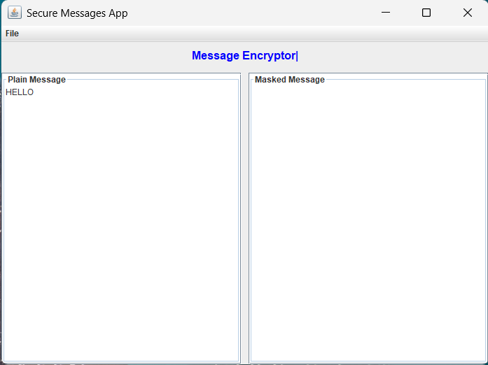

# Secure Messages Application



## Overview
A secure messaging desktop application implementing Caesar Cipher encryption, developed by WeDoSecureApps. The application features:
- File operations (Open/Save)
- Message encryption/decryption
- User-friendly GUI interface

## Features
- **Caesar Cipher Encryption** (Shift value: 3)
- **File Menu Operations**:
  - Open text files
  - Encrypt message contents
  - Save encrypted messages
  - Clear text areas
  - Exit application
- **Dual Text Areas**:
  - Plain message (input)
  - Encrypted message (output)

## Repository Structure
WeDoSecureApps-SecureMessages/
├── src/
│ ├── Message.java
│ ├── MessageEncryptor.java
│ ├── SecureMessagesFrame.java
│ └── SecureMessagesApp.java
├── images/
│ ├── 1.png (Main Interface)
│ ├── 2.png (File Menu)
│ └── 3.png (Encryption Demo)
└── README.md

text

## Installation
1. Clone the repository:
   ```bash
   git clone https://github.com/LungeloMK/WeDoSecureApps-SecureMessages.git
Open in NetBeans IDE 8.2

Build and run SecureMessagesApp.java

Usage
Open a file: File → Open (contents appear in Plain Message area)

Encrypt: File → Encrypt Message (results in Encrypted Message area)

Save: File → Save Encrypted Message

Clear: File → Clear

Exit: File → Exit

Encryption Technique
WeDoSecureApps uses a modified Caesar Cipher:

Shift value: 3 positions

Example: 'A' → 'D', 'B' → 'E'

Case-sensitive

Non-alphabet characters remain unchanged

Screenshots
Main Interface	File Menu Options
https://images/1.png	https://images/2.png
Encryption Demo
https://images/3.png
Dependencies
Java JDK 1.8

NetBeans IDE 8.2 (recommended)
